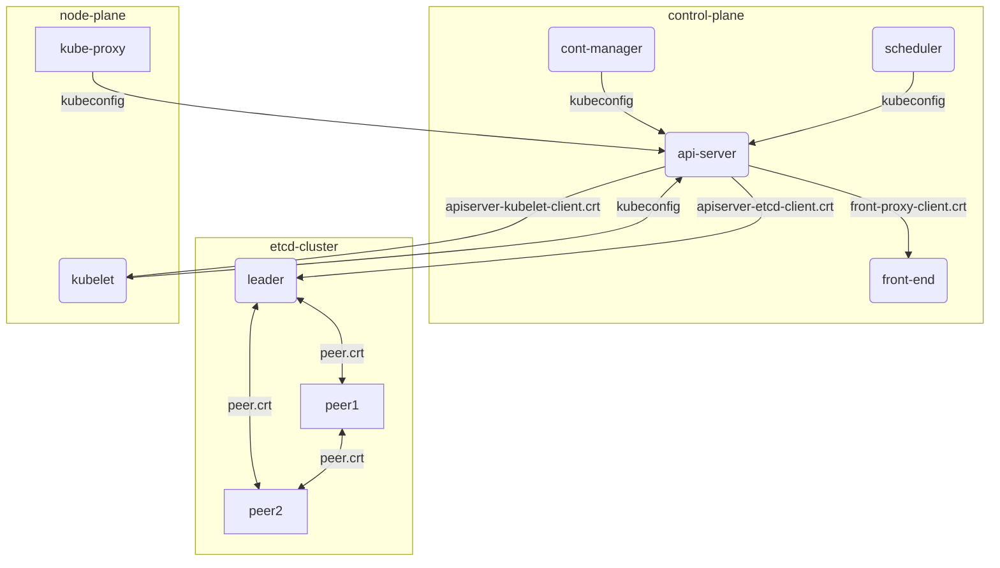
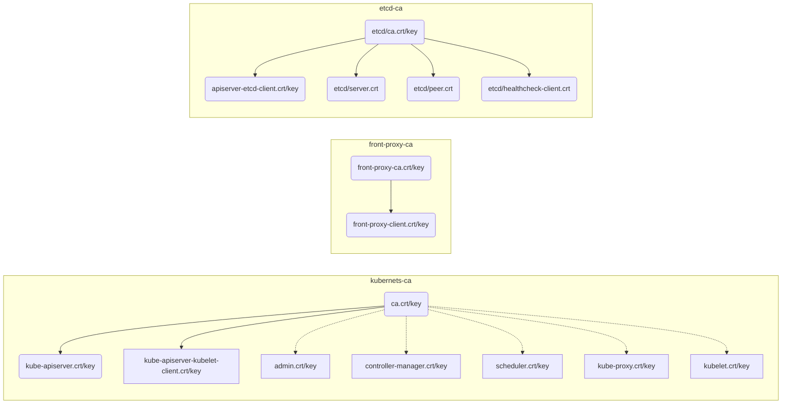

# K8S集群默认证书梳理

K8S集群涉及多个组件间的通信，为了保障通信安全，各组件间使用加密通信；因此，需要设置相关的证书。eggo遵循[K8S官网的证书最佳实践](https://kubernetes.io/docs/setup/best-practices/certificates/)，来生成所有证书。

## 各组件之间的证书关联关系

## 证书分类

证书分为三块：

- etcd集群相关证书；
- api-server相关证书；
- 拓展api，front-proxy相关证书；

每一块都有自己的根证书CA：

| 路径                   | 默认 CN                   | 描述                                                         |
| ---------------------- | ------------------------- | ------------------------------------------------------------ |
| ca.crt,key             | kubernetes-ca             | Kubernetes 通用 CA                                           |
| etcd/ca.crt,key        | etcd-ca                   | 与 etcd 相关的所有功能                                       |
| front-proxy-ca.crt,key | kubernetes-front-proxy-ca | 用于 [前端代理](https://kubernetes.io/zh/docs/tasks/extend-kubernetes/configure-aggregation-layer/) |

各自签名的证书如下：

**注：kubernetes-ca部分证书密钥是虚线连接的，表示的是这些证书只是用于生成kube-config，然后就会被删除。**

## 服务帐户密钥对

用于K8S集群内部通信的认证，启动pod时，会自动把它挂载到pod中，用于pod中业务和api-server的认证通信。

| 私钥路径 | 公钥路径 | 命令                    | 参数                               |
| -------- | -------- | ----------------------- | ---------------------------------- |
| sa.key   |          | kube-controller-manager | --service-account-private-key-file |
|          | sa.pub   | kube-apiserver          | --service-account-key-file         |

## 证书生成

证书的生成完全按照上述逻辑生成，具体见`openssl_new_cas.sh`。

