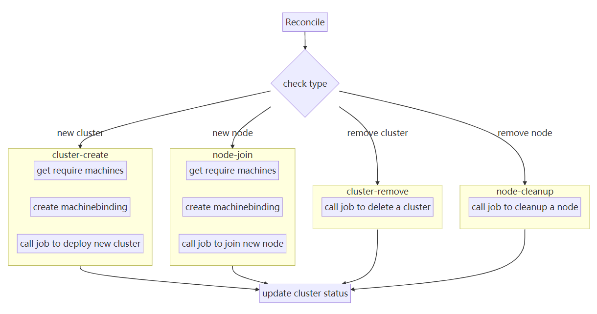

# Eggo CRD集群管理设计

Eggo支持多种模式，可以通过命令行管理集群，也可以通过集群管理集群。而集群管理集群需要集群能够识别待部署集群的配置信息以及操作控制，因此需要设计Eggo的CRD控制器和自定义资源。本文主要说明Eggo的CRD的设计。

## 自定义资源

首先，关注Eggo的自定义资源。Eggo涉及两种自定义资源：`Machine`和`Cluster`。`Machine`负责节点机器的管理，`Cluster`负责集群的管理。

### Machine资源

Eggo存在长期的规划，而第一阶段的场景为节点机器已经完成OS安装和基本的环境配置；因此`Machine`自定义资源主要是作为一个信息承载、权限管理以及资源池化的作用。

- 信息承载：Machine记录了节点机器的主要信息，例如IP、hostname、username、password等等重要信息；
- 权限管理：Machine应该由独立的运维人员管理、配置，可以通过RBAC进行权限限制，Cluster只能使用Machine，而不能删除和创建Machine；
- 资源池化：集群中的Machines可以看作一个池化的资源，Cluster部署时通过绑定Machine使用；

### Cluster资源

`Cluster`承载管理集群的所有信息，主要包括依赖Machine的列表信息、控制面配置信息、网络配置信息、`addons`配置信息。

## 控制器

对应自定义资源，Eggo也需要支持两种控制器：`Machine`和`Cluster`的控制器。

### Machine控制器

第一阶段，Machine控制器只做变更信息记录。

### Cluster控制器

需要负责集群的管理，包括：集群部署、集群删除、节点加入、节点删除以及集群更新。

Cluster控制器主要逻辑如下：

