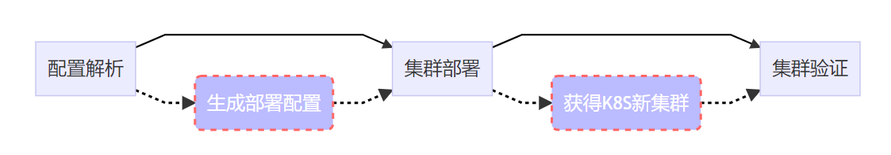
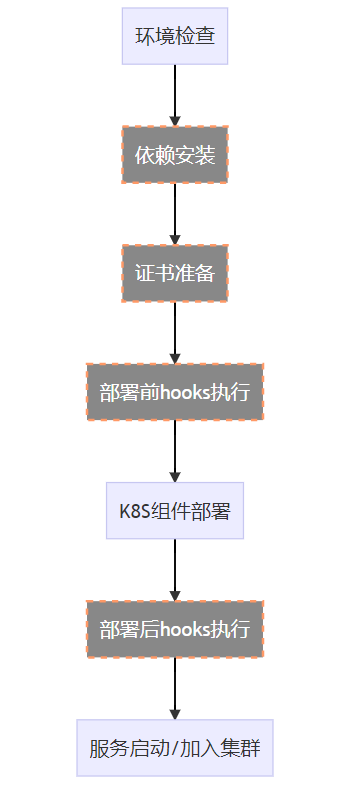
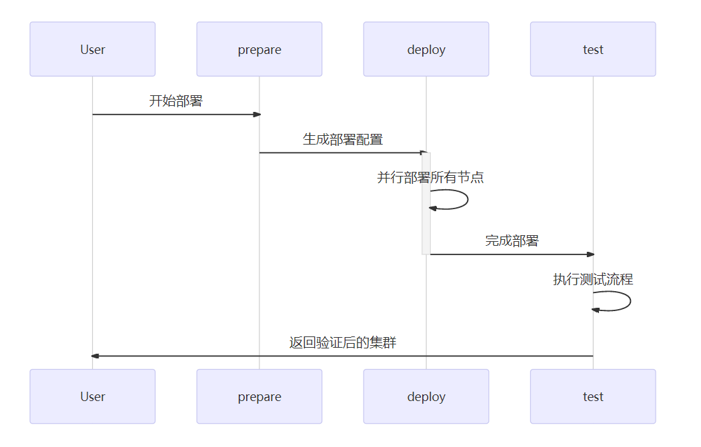

## 概要设计


云集群管理的节点和待部署集群的网络关系：**至少有一个节点能够和待部署集群直连互通，一个节点可以和多个集群直连互通。**

配置库新增一个部署任务时，云集群根据网络亲和关系，把部署的任务下发到合适的节点去运行。

## 详细设计

### 点火组件

#### 整体流程

包括三个主要流程：

- 配置解析
- 集群部署
- 集群验证



#### 集群部署

整个集群的部署，以多个节点并行、单个节点顺序执行的思路完成。

集群的部署流程：


节点部署流程：



#### 部署序列图

部署模块关系如下：



- 点火组件首先解析用户传入的部署配置信息
- 然后启动部署机制，根据配置信息选择合适的部署驱动（支持二进制和kubeadm等）；
- 生成各节点对应的部署配置信息；
- 并发启动各节点的部署流程；
- 等待所有节点部署任务完成；
- 启动集群测试；

### 配置规范

#### 集群部署配置规范

```bash
Spec:
	cluster:
		certs:
			- module: // 使用证书的组件，如：kubelet
			  key: // 对应组件的参数，如：--tls-private-key-file
			  cert: // 证书，可以是文件路径也可以是完整的证书内容
			  savepath: //证书在节点存储的路径
		k8s:
		dependences:
	nodes:
		- type:
		  configs:
		- hooks:
			- type:
			  command:
			  timeout:
	tests:
		- config:
	hooks:
		- type:
		  command:
		  timeout:
```


#### 节点部署配置规范

```bash
Spec:
	checks:
	installs:
		prepare:
		k8s:
	hooks:
```