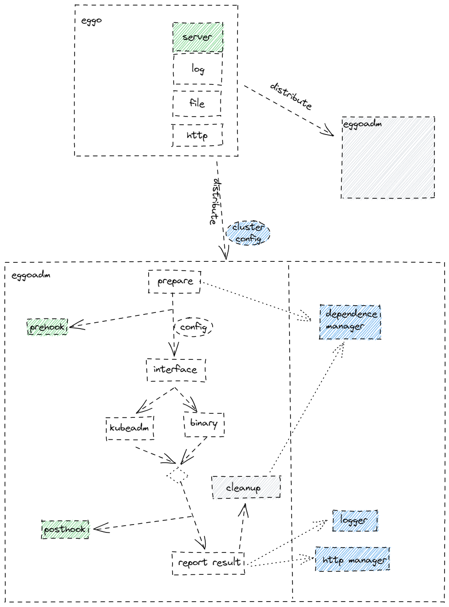
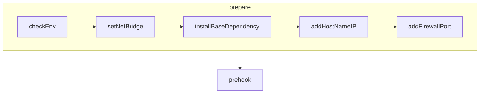
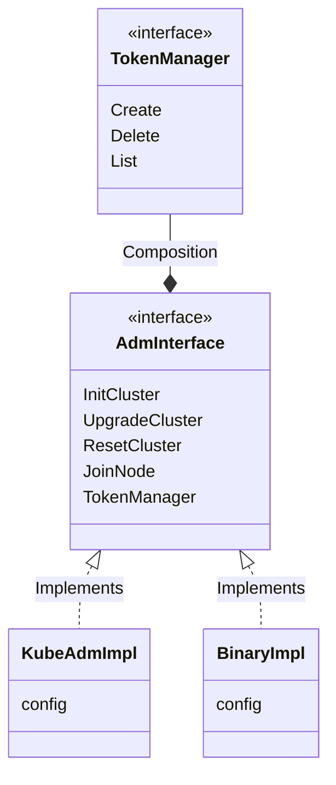
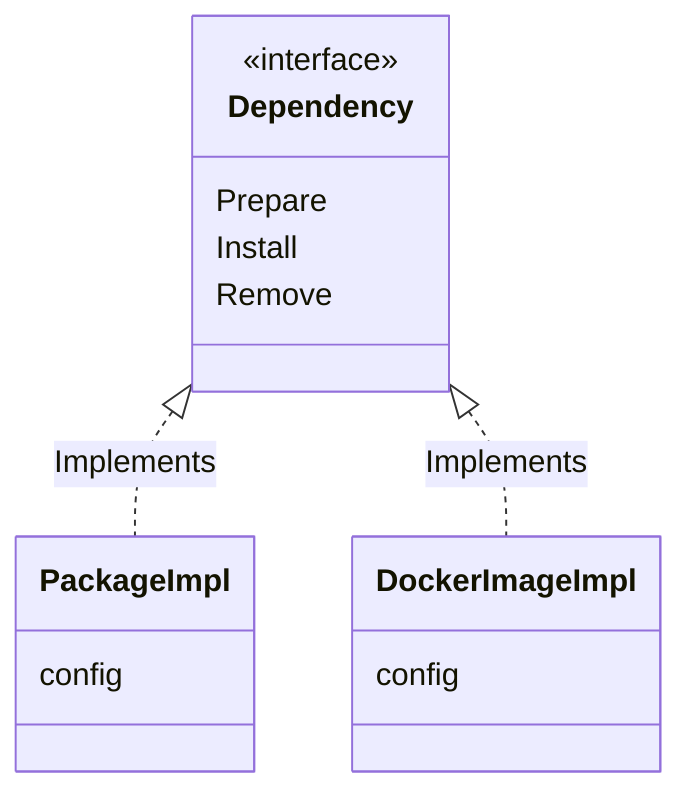

# 背景

当前eggo的集群部署安装的逻辑都包含在eggo中，导致节点部署过度依赖ssh的操作，而大量的ssh链接会成为并发的瓶颈；而且耦合的设计对于后续的拓展也是不利的。因此，我们需要一个eggoadm的独立二进制，负责集群节点的管理。

## 概要设计

相关模块关系图如下：

### prepare模块

负责节点部署的前期工作：

\- 下载节点部署依赖的组件（证书、二进制、token等等）；

\- 安装依赖组件；

\- 启动需要的依赖组件服务；

\- 设置节点的前置配置（例如打开相关端口，关闭swap等）；

\- 生成驱动模块使用的配置文件；

### 驱动模块

负责K8S节点的操作（部署、清理）：

\- 封装统一的接口；

\- 提供kubeadm的实现；

\- 提供二进制的实现；

\- 记录结果（例如控制面初始化需要返回token）；

### 日志模块

负责整个流程的日志记录

### http客户端

负责与管理层的通信，日志上传、结果回传等等

### 依赖管理模块

负责依赖组件的管理，包括下载、安装、清理等。

## 详细设计

为了兼容当前eggo的设计，第一阶段继承eggo的InfrastructureAPI，依赖组件由InfrastructureAPI提供，先完全其他功能；第二阶段，基于文件服务器或者docker镜像的方式替代InfrastructureAPI，由eggoadm的依赖管理模块完成。

### prepare模块

### 驱动模块

### 日志模块

使用开源的`logrus`框架，收集日志到文件中。

### http客户端

待eggo服务端完成，再开始实现。

### 依赖管理模块

为了适配当前的版本，提供一个`PackageImpl`的实现；以及后续支持`docker`镜像方式的实现。