# Eggo方案设计

## 整体方案

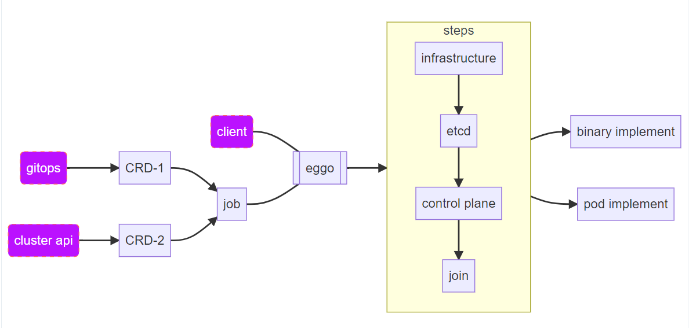

Eggo支持三种部署方式：

- 命令行模式：适用于物理机拉起小规模的K8S集群，用于测试开发使用；
- gitops模式：适用于通过gitops管理集群配置的场景，管理大量K8S集群的场景；
- cluster api模式：适用于对接cluster api开源接口；

## 部署组件

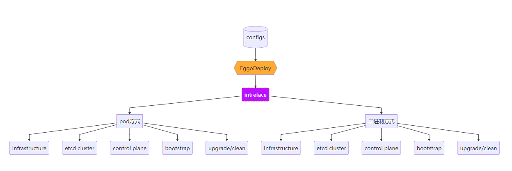

部署组件负责集群的实际部署工作，主要包括如下部分：

- 基础设施：负责集群节点（物理机、虚拟机等）的准备工作，系统安装、节点间网络互通部署、磁盘安装、依赖组件安装等；
- 独立ETCD集群部署：ETCD集群独立部署，不在控制面或者工作节点以保证数据的安全；
- 集群的首个控制面：部署第一个控制面，需要负责证书生成、kubeconfig生成以及组件服务部署等；
- bootstrap：负责worker节点或者其他控制面节点加入K8S集群的部署工作，证书书拷贝、组件服务部署；
- upgrade/clean：集群组件升级或者清理；

## 详细设计

### 部署组件

Eggo组件交互关系图

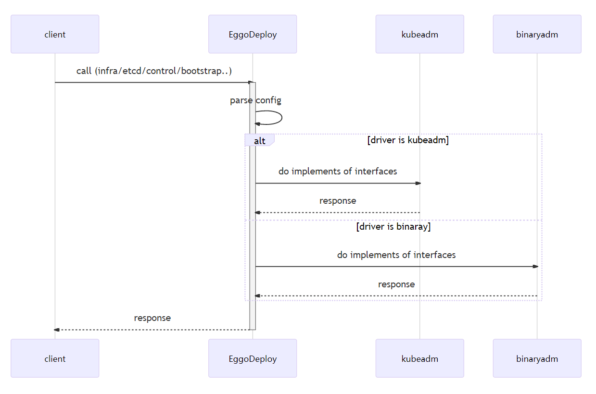

#### infrastructure流程

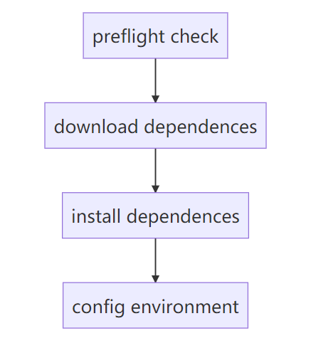

#### etcd集群流程

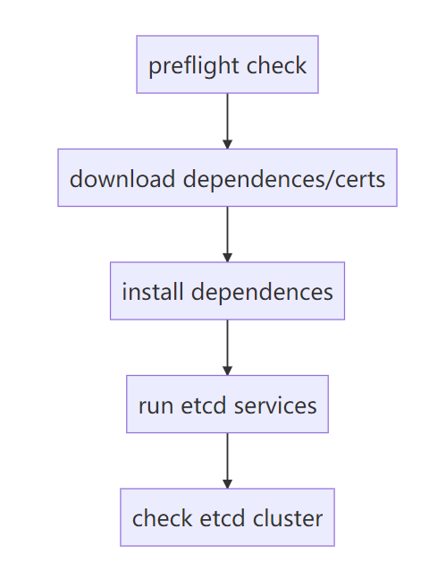

#### control plane流程

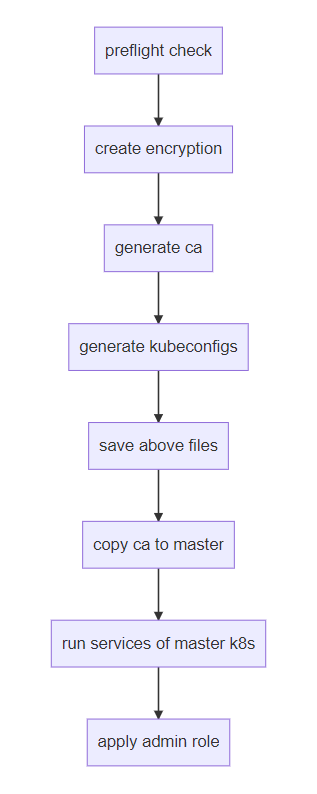

#### bootstrap流程

#### clean流程

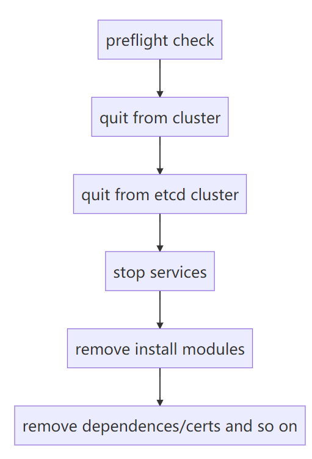

#### node-task任务管理机制

旨在统一管理node上执行task，为节点部署集群，提供统一的命令和文件拷贝接口。

模块时序如下：

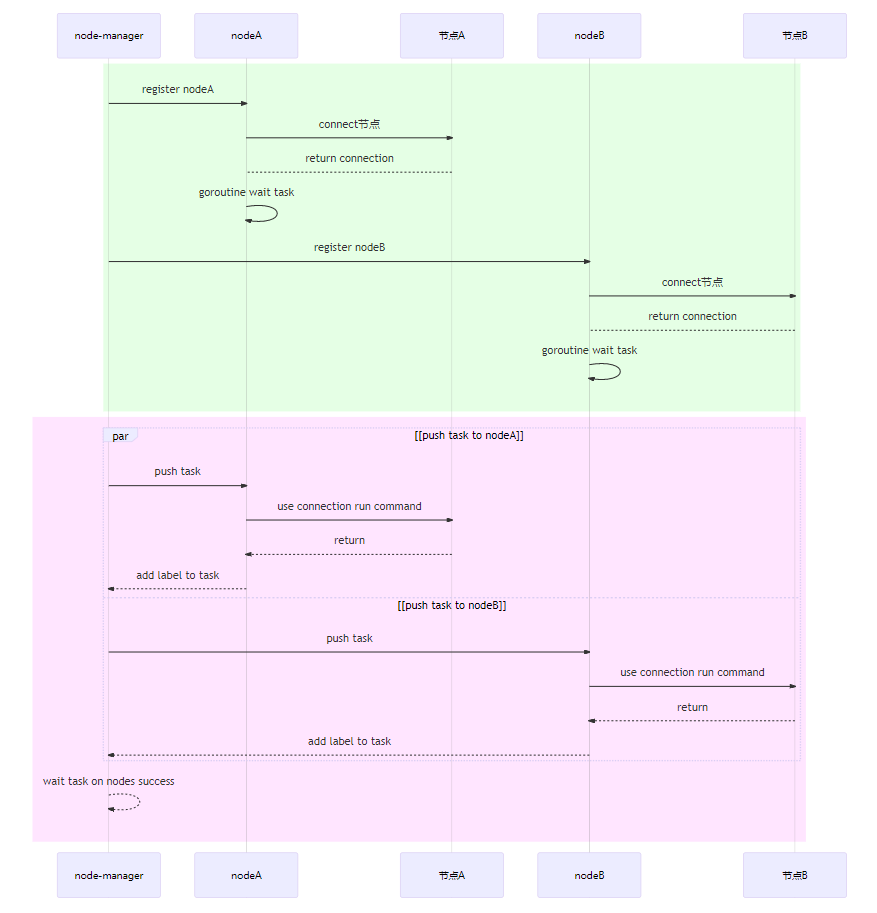

类和接口关系如下：

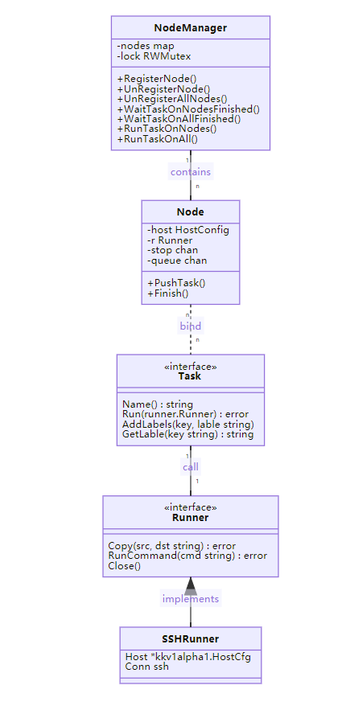

#### 证书管理设计

集群的创建、新节点的加入都依赖证书；因此Eggo需要创建、存储和分发CA证书，并且协助节点创建其他依赖的证书；证书管理分为两种场景：

- 命令行管理集群的场景，需要创建并且本地存储ca证书和admin.kubeconfig，在集群部署master和node节点时分发相应的ca证书；
- 集群管理集群的场景，需要创建并且根据集群对应的存储ca证书和admin.kubeconfig到元集群的ETCD中，在集群部署master和node节点时分发相应的ca证书；

证书管理流程图如下：

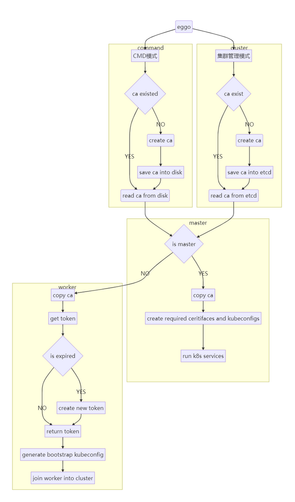

时序关系如下：

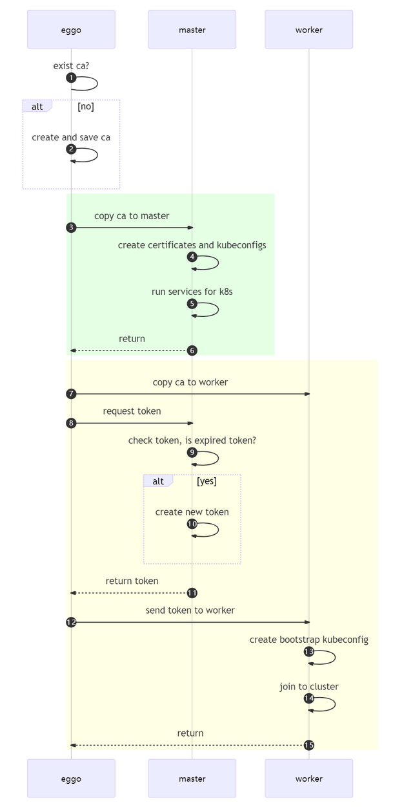

