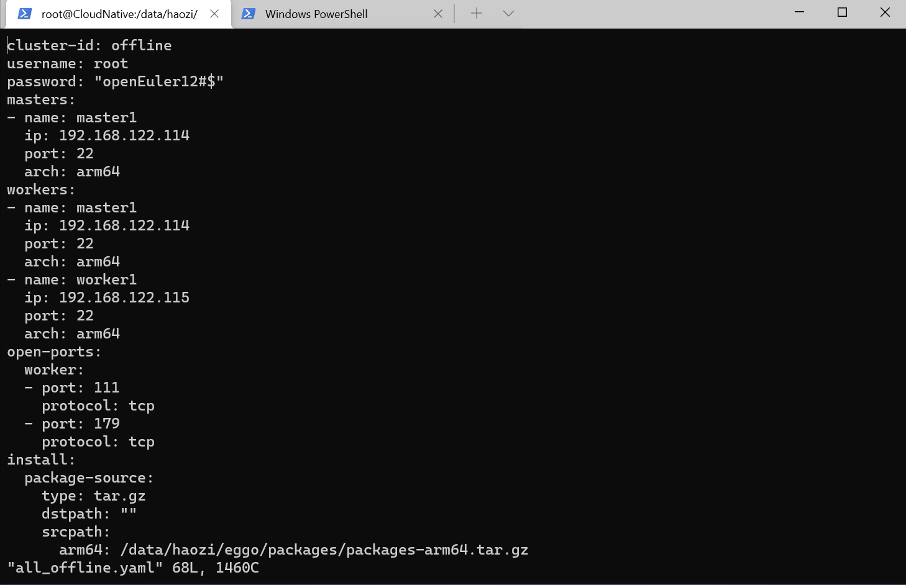

# eggo操作手册

## 准备工作

1) 待安装机器配置好机器的hostname并安装tar命令，确保能使用tar命令解压tar.gz格式的压缩包。配置ssh确保能远程访问，如果ssh登录的是普通用户，还需要确保该用户有免密执行sudo的权限。
   
2) 在任意一台能连接上述所有机器的机器上，根据以下编译安装的说明编译安装eggo，也可以拷贝编译好的eggo直接使用。
#### 编译安装
```bash
# 使能go mod
$ export GO111MODULE=on
# 设置goproxy为国内代理，也可以设置为其他公司的代理
$ go env -w GOPROXY=https://goproxy.cn,direct
# 下载依赖库
$ go mod tidy
# 编译
$ make
# 使用vendor本地编译，前提需要之前下载过依赖的go库
$ go mod vendor
$ make local
# 安装
$ make install
```
#### 运行测试

```bash
$ make test
```

3) 如果是**在线部署**，直接将[config/all_online_install](/config/all_online_install.config)配置为与自己所使用机器信息相符的内容，再按照“**部署集群**”章节中列出的过程进行部署即可。

4) 如果是离线部署，则需要准备`K8S`以及相关的离线包，以`openeuler20.09`为例，可以从对应的软件源或者ISO提取依赖的软件包文件，然后打包到离线包中；离线包的存放格式如下：
5) 
```
$ tree
.
.
├── bin
├── dir
├── file
│   └── calico.yaml
├── image
│   └── images.tar
└── pkg
    ├── conntrack-tools-1.4.6-1.oe1.aarch64.rpm
    ├── containernetworking-plugins-0.8.2-4.git485be65.oe1.aarch64.rpm
    ├── coredns-1.7.0-1.0.oe1.aarch64.rpm
    ├── docker-engine-18.09.0-115.oe1.aarch64.rpm
    ├── etcd-3.4.14-2.aarch64.rpm
    ├── kubernetes-client-1.20.2-4.oe1.aarch64.rpm
    ├── kubernetes-kubelet-1.20.2-4.oe1.aarch64.rpm
    ├── kubernetes-master-1.20.2-4.oe1.aarch64.rpm
    ├── kubernetes-node-1.20.2-4.oe1.aarch64.rpm
    ├── libcgroup-0.42.2-1.oe1.aarch64.rpm
    ├── libnetfilter_cthelper-1.0.0-15.oe1.aarch64.rpm
    ├── libnetfilter_cttimeout-1.0.0-13.oe1.aarch64.rpm
    ├── libnetfilter_queue-1.0.5-1.oe1.aarch64.rpm
    └── socat-1.7.3.2-8.oe1.aarch64.rpm

5 directories, 16 files
```

- 离线部署包的目录结构与集群配置config中的package的类型对应，package类型共有pkg/repo/bin/file/dir/image/yaml/shell八种

-  bin目录存放二进制文件，对应package类型 bin

-  dir目录存放需要copy到目标机器的目录，需要配置dst目的地路径，对应package类型dir

-  file目录存放file、yaml、shell三种类型的文件。其中file类型代表需要copy到目标机器的文件，同时需要配置dst目的地路径；yaml类型代表用户自定义的yaml文件，会在集群部署完成后apply该文件；shell类型代表用户想要执行的脚本，同时需要配置schedule执行时机，执行时机包括prejoin节点加入前、postjoin节点加入后、precleanup节点退出前、postcleanup节点退出后四个阶段

- image目录存放需要导入的容器镜像，例如网络插件镜像以及pause镜像。对应package类型image。**如果是在线安装，则由容器运行时自动从镜像仓库下载，不需要准备images.tar包**。以calico插件依赖的容器镜像为例，可以根据calico.yaml里面定义的镜像全名进行下载导出。该tar包包含的镜像必须是使用docker或者isula-build等兼容docker的tar包格式的命令，使用`docker save -o images.tar images1:tag images2:tag ...... ` 或类似命令将所有镜像一次性导出到images.tar包中，需要确保执行load镜像时能一次将images.tar导入成功。以上述calico镜像为例，镜像导出命令为：
```
$ docker save -o images.tar calico/node:v3.19.1 calico/cni:v3.19.1 calico/kube-controllers:v3.19.1 calico/pod2daemon-flexvol:v3.19.1 k8s.gcr.io/pause:3.2
```

- pkg目录下存放需要安装的rpm/deb包，对应package类型pkg


## 基本用法
这里列出eggo的基本执行指令，后续“部署集群”章节中，有部署集群的具体过程。

```bash
# 生成默认配置模板
$ eggo template -f test.yaml
# 生成指定master节点IP列表的模板
$ eggo template  --masters=192.168.0.1  --masters=192.168.0.2 -f test.yaml
# template当前支持多个参数覆盖默认值
$ ./eggo template --help
      --etcds stringArray          set etcd node ips
  -l, --loadbalancer stringArray   set loadbalancer node (default [192.168.0.1])
      --masters stringArray        set master ips (default [192.168.0.2])
  -n, --name string                set cluster name (default "k8s-cluster")
      --nodes stringArray          set worker ips (default [192.168.0.3,192.168.0.4])
  -p, --password string            password to login all node (default "123456")
  -u, --user string                user to login all node (default "root")

# 使用上面template命令生成的配置文件，创建集群
$ eggo deploy -f test.yaml

# 使用上面的配置清理集群
$ eggo cleanup -f test.yaml
```


## 部署过程展示

### 全在线部署

例如openEuler21.09已经存在集群部署依赖的所有组件，因此可以通过在线部署的方式部署。详细配置文件见[config/all_online_install](../config/all_online_install.config)


### 全离线部署

例如openEuler21.09已经准备好集群部署依赖的所有组件，因此可以通过离线部署的方式部署。详细配置文件见[config/all_offline_install](../config/all_offline_install.config)




## 部署集群

### 1. 生成模版配置

准备eggo部署时使用的yaml配置文件。可以使用下面的命令生成一个模板配置，并打开yaml文件对其进行增删改来满足不同的部署需求。

```
$ eggo template -f template.yaml
```

另外，可以使用命令行修改机器列表等基本信息。

```
$ eggo template -f template.yaml -n k8s-cluster -u username -p password --masters 192.168.0.1 --masters 192.168.0.2 --workers 192.168.0.3 --etcds 192.168.0.4 --loadbalancer 192.168.0.5
```

具体的deploy.yaml的配置见[配置文件说明](/docs/configuration_file_description.md)


### 2. 执行命令安装k8s集群

```
$ eggo -d deploy -f deploy.yaml
```

- -d参数表示打印调试信息

- -f参数指定部署时使用的配置文件，不指定的话会从默认文件~/.eggo/deploy.yaml加载配置进行集群安装部署。

  说明：集群部署结束后可以执行命令`echo $?`来判断是否部署成功，输出为0则为部署成功。如果部署失败，则`echo $?`为非0,并且终端也会打印错误信息。

**注意: 如果部署被强制中断，或者异常终止，建议使用清理命令`eggo cleanup -f deploy.yaml`，保证无残留信息。**

### 3. 将master或者worker加入到k8s集群

join单个节点：

```
$ eggo -d join --id k8s-cluster --type master,worker --arch arm64 --port 22 192.168.0.5
```

* -d参数表示打印调试信息
* --id集群的id
* --type可以为master或者worker，默认为worker，也可以同时作为master和worker加入，值为master,worker，如果添加的类型里有master，则会同时部署etcd到该节点。
* --arch机器架构，支持amd64、arm64等多种配置，需要对应架构的安装包。不指定默认为amd64
* --port使用ssh登录的端口号，不填则使用原有配置，无配置则用默认值22


join多个节点时需要将join的信息放到yaml配置里：

```
$ eggo -d join --id k8s-cluster --file join.yaml
```

* --file 指定yaml文件，yaml文件格式如下

  ```
  masters:                          // 配置master节点的列表，建议每个master节点同时作为worker节点，否则master节点可以无法直接访问pod
  - name: test0                     // 该节点的名称，为k8s集群看到的该节点的名称
    ip: 192.168.0.2                 // 该节点的ip地址
    port: 22                        // ssh登录的端口
    arch: arm64                     // 机器架构，x86_64的填amd64
  - name: test1
    ip: 192.168.0.3
    port: 22
    arch: arm64
  workers:                          // 配置worker节点的列表
  - name: test0                     // 该节点的名称，为k8s集群看到的该节点的名称
    ip: 192.168.0.2                 // 该节点的ip地址
    port: 22                        // ssh登录的端口
    arch: arm64                     // 机器架构，x86_64的填amd64
  - name: test2
    ip: 192.168.0.5
    port: 22
    arch: arm64
  ```

## 查看集群信息

```bash
$  eggo list
Name            Masters Workers Status
k8s-cluster     2       2       success
```

查看eggo管理的集群信息，第一列表示集群的名称，第二列表示集群有多少个`master`节点，第三列表示集群有多少个`worker`节点，第四列表示集群的状态信息。

## 清理拆除集群

### 1. 拆除整个集群

```
$ eggo -d cleanup --id k8s-cluster -f deploy.yaml
```

- -d参数表示打印调试信息

- --id集群的id

- -f参数指定部署时使用的配置文件，不指定的话会从默认文件/etc/eggo/$ClusterID/deploy.yaml加载配置进行集群的清理拆除。建议不要加-f参数，而是使用保存的配置文件进行集群拆除。

  说明：当前集群拆除过程不会清理容器和镜像，但如果部署时配置了需要安装容器引擎，则容器引擎会被清除，可能会导致容器本身运行异常。另外清理过程中可能会打印一些错误信息，一般都是由于清理过程中操作集群时返回了错误的结果导致，不需要过多关注，集群依然能正常拆除。


###  2. 也可以只拆除指定节点

```
$ eggo -d delete --id k8s-cluster 192.168.0.5 192.168.0.6
```

* -d参数表示打印调试信息
* --id集群的id
* --type可以为master或者worker，默认worker
* 192.168.0.5 需要删除的机器的IP地址列表或者名称列表，注意第1个master节点不能删除

## 规范说明

### hook规范

详情见[hooks spec](./hooks_of_eggo.md)
