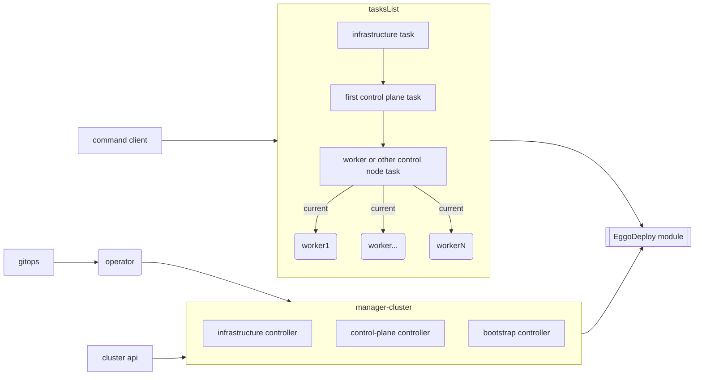
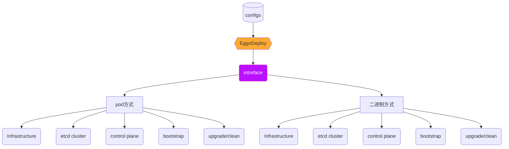
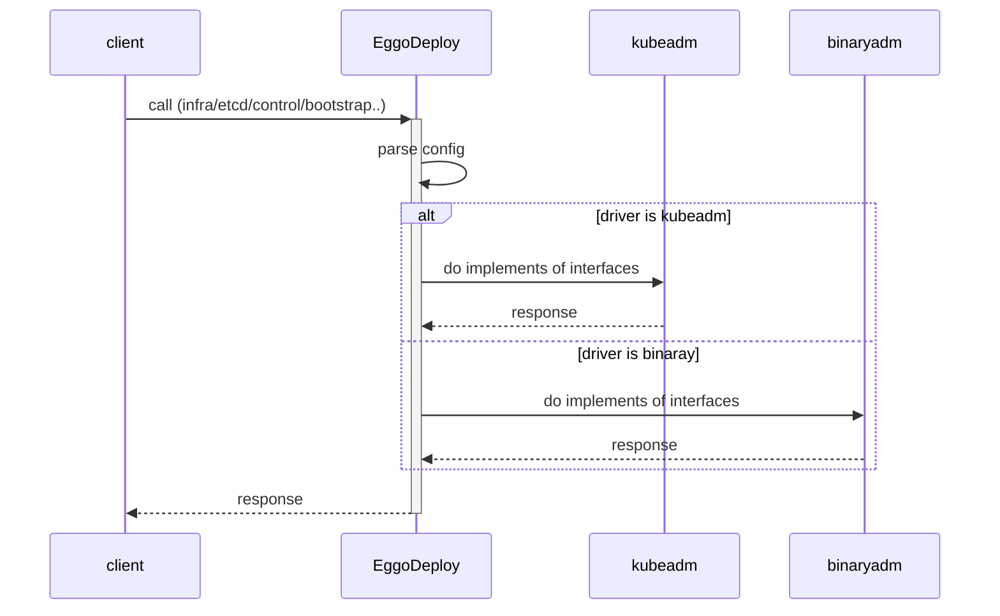
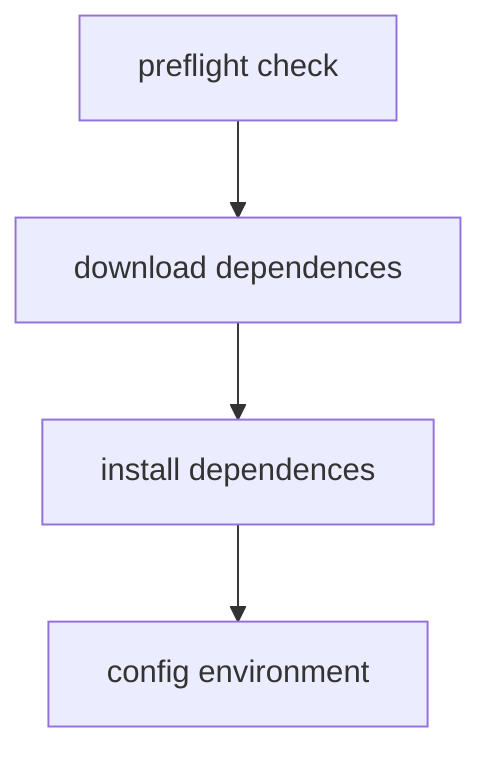
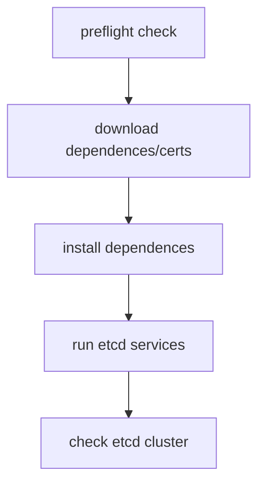
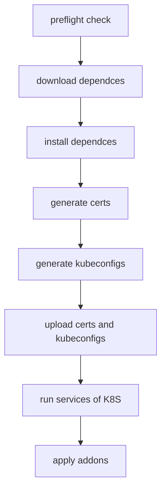
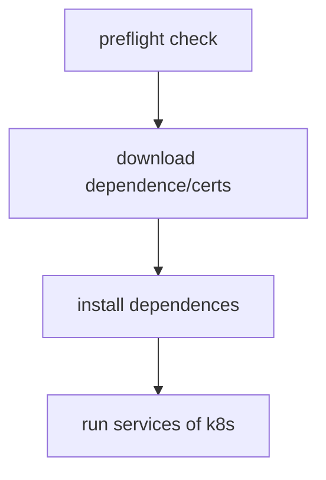
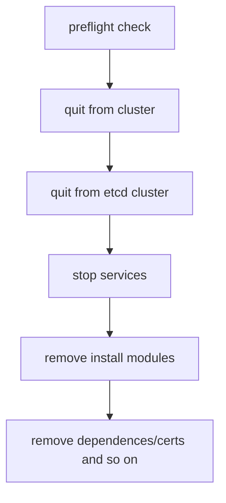
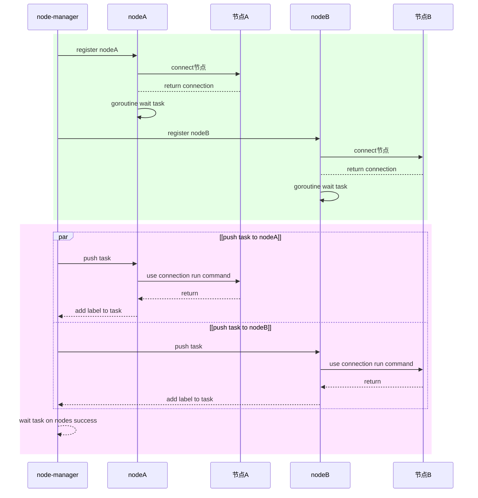
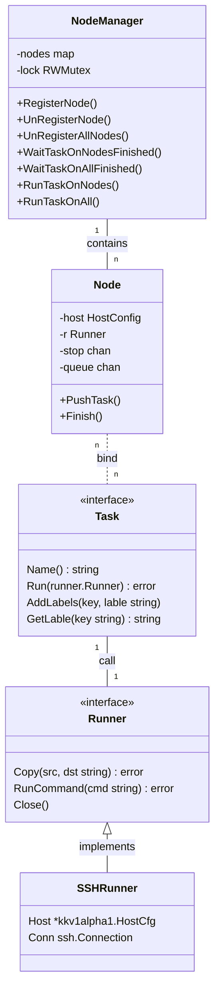

# Eggo方案设计

## 概要方案

Eggo支持三种部署方式：

- 命令行模式：适用于物理机拉起小规模的K8S集群，用于测试开发使用；
- gitops模式：适用于通过gitops管理集群配置的场景，管理大量K8S集群的场景；
- cluster api模式：适用于对接cluster api开源接口；

### 部署组件

部署组件负责集群的实际部署工作，主要包括如下部分：

- 基础设施：负责集群节点（物理机、虚拟机等）的准备工作，系统安装、节点间网络互通部署、磁盘安装、依赖组件安装等；
- 独立ETCD集群部署：ETCD集群独立部署，不在控制面或者工作节点以保证数据的安全；
- 集群的首个控制面：部署第一个控制面，需要负责证书生成、kubeconfig生成以及组件服务部署等；
- bootstrap：负责worker节点或者其他控制面节点加入K8S集群的部署工作，证书书拷贝、组件服务部署；
- upgrade/clean：集群组件升级或者清理；

## 详细设计

### 部署组件

EggoDeploy组件交互关系图

#### infrastructure流程

#### etcd集群流程

#### control plane流程

#### bootstrap流程

#### clean流程

#### node-task任务管理机制

旨在统一管理node上执行task，为节点部署集群，提供统一的命令和文件拷贝接口。

模块时序如下：

类和接口关系如下：

