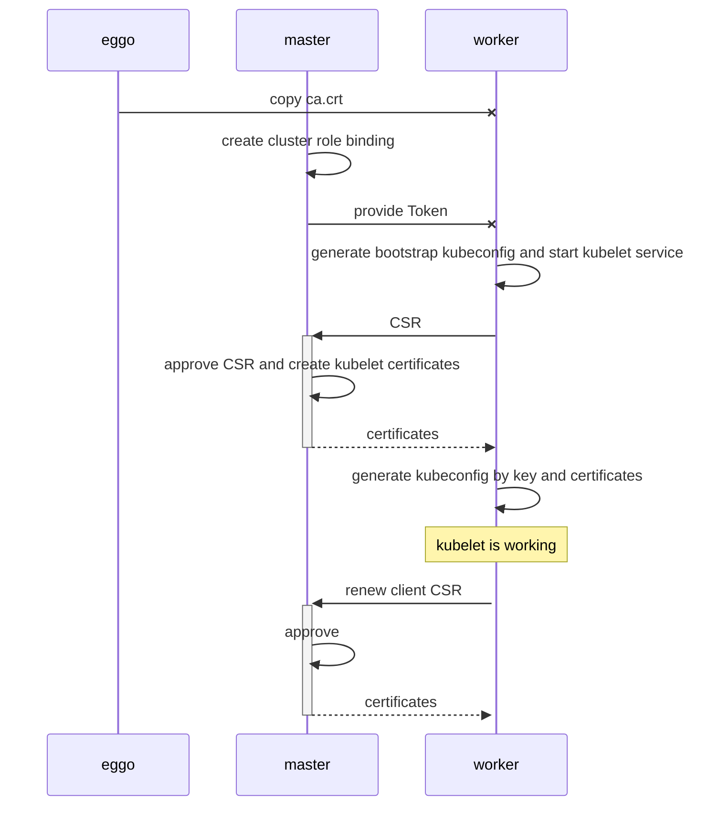

# 工作节点加入集群流程

### 准备工作
- eggo节点生成CA证书

- master节点生成Token，有效期XX h，过期自动更新一个新的Token

- 创建ClusterRoleBinding进行授权（kubelet 访问 kube-apiserver）

  1. kubelet创建CSR权限。

     > Kubernets提供了system:node-bootstrapper这一ClusterRole，只需将所有待加入的worker节点认证为group system:bootstrappers的成员，并将该group与system:node-bootstrapper这一ClusterRole绑定

  2. 自动approve group system:bootstrappers 的 CSR请求

     > 将待加入的worker节点所在的group system:bootstrappers，与ClusterRole system:certificates.k8s.io:certificatesigningrequests:nodeclient绑定

  3. 自动approve kubelet对其client证书的续约请求 

     > 正常工作的节点所在的group为system:node，将group system:node与ClusterRole system:certificates.k8s.io:certificatesigningrequests:selfnodeclient绑定

- 其他授权 （kube-apiserver 访问 kubelet）

  1. kube-apiserver访问kubelet API权限

     > ClusterRole system:kubelet-api-admin

  2. approve server CSR请求

     > 无法自动approve，需要手动approve

  3. 自动approve kubelet对其server证书的续约请求

     > ALPHA，未来定义可能会改变
     >
     > 正常工作的节点所在的group为system:node，创建ClusterRole approve node server renewal csr，并与group system:node绑定

### worker加入集群流程

1. eggo节点将CA证书copy至worker节点
2. k8s集群创建ClusterRoleBinding进行授权
3. master提供Token，worker节点根据Token生成bootstrap kubeconfig
4. worker节点启动kubelet服务，指定bootstrap kubeconfig、ca.crt等信息

后续流程由k8s自动完成

5. kubelet根据bootstrap kubeconfig发送CSR到kube-apiserver
6. 在master节点CSR被自动approve，然后生成所需的证书并反馈给kubelet
7. kubelet取回证书，并创建kubelet kubeconfig，其中包含密钥和已签名证书
8. kubelet可以正常工作

证书接近过期

9. kubelet自动请求更新证书
10. 更新的证书被批复签发
